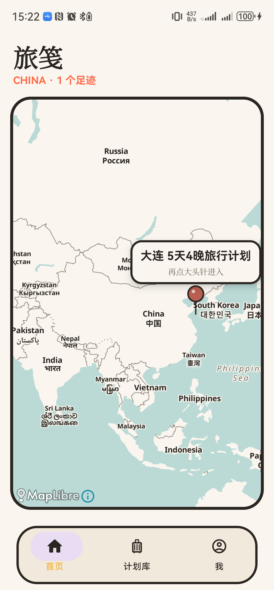
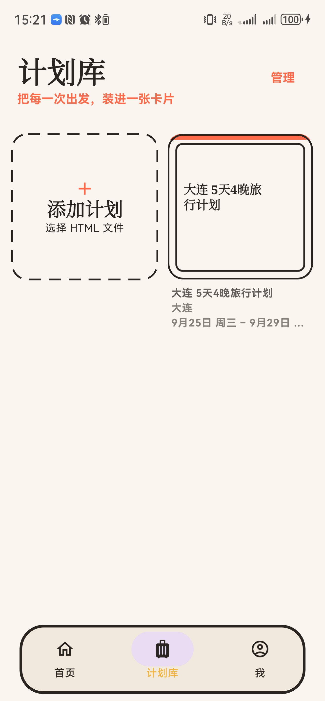
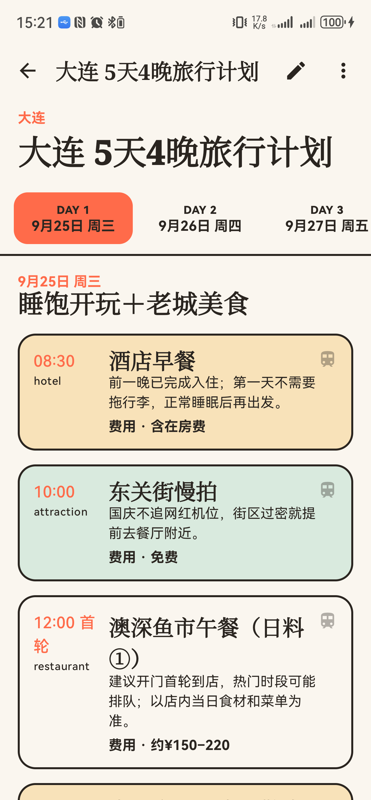
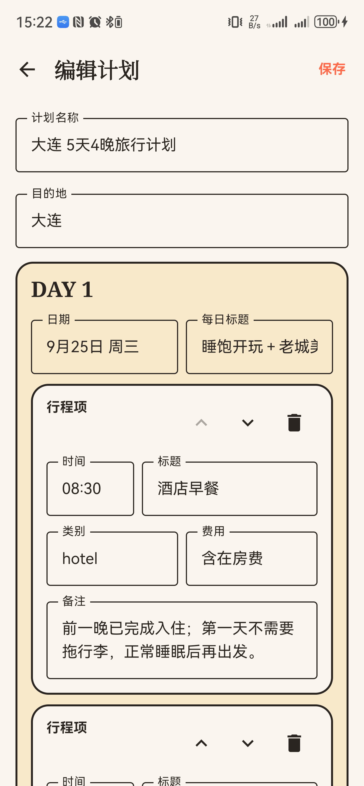
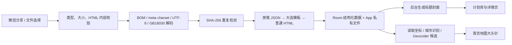

# 🧳 旅笺 · Lujian

<div align="center">

### 把一份 HTML 行程，变成手机里随手翻阅的旅行手账

**导入文件 · 自动认地点 · 地图落针 · 按天阅读 · 随手编辑 · 本地保存**

</div>

> 旅行计划不该在聊天记录里失踪，也不该在出发当天变成一场“文件到底存哪了”的寻宝游戏。<br>
> **旅笺**把微信或手机中的 HTML 行程收进一个原生 Android App：地图负责看世界，卡片负责收藏出发，日期轴负责陪你过好每一天。

旅笺以本地使用为主：无需注册账号，不把旅行计划上传到业务服务器。地图底图与未知地点解析需要网络，已经导入的计划可离线阅读。

## 📸 现在长这样

<table>
  <tr>
    <td align="center" width="25%">
      <br>
      <b>📍 地图记住目的地</b><br>
      <sub>点一下看计划，再点一下就出发</sub>
    </td>
    <td align="center" width="25%">
      <br>
      <b>🗃️ 每次旅行一张卡</b><br>
      <sub>封面、标题、地点、日期一眼看清</sub>
    </td>
    <td align="center" width="25%">
      <br>
      <b>🗓️ 一天一天读</b><br>
      <sub>顶部日期轴切换，不在长网页里迷路</sub>
    </td>
    <td align="center" width="25%">
      <br>
      <b>✍️ 行程随手改</b><br>
      <sub>时间、费用、备注和顺序都能调整</sub>
    </td>
  </tr>
</table>

> 截图来自 Huawei PLA-AL10 真机；`1.1.0` 已在同一设备完成三页签阅读器实机回归。

## ✨ 核心能力

| 能力 | 旅笺怎么做 | 你得到什么 |
| --- | --- | --- |
| 📥 HTML 导入 | 系统文件选择器、微信“用其他应用打开/分享” | 不用复制粘贴，原文件直接收进计划库 |
| 🧭 地点识别 | 读取旅笺坐标标签、常见地理标签、城市文本与 Geocoder 候选 | 导入后自动在地图落针；不确定时由你确认 |
| 🗺️ 纸张地图 | MapLibre + 低饱和纸张主题 | 中国计划看中国，出现境外目的地自动看全球 |
| 📌 计划大头针 | 复古红色球头、短墨色直针、针上方信息框 | 第一次点开名称，第二次进入计划 |
| 🗃️ 计划库 | 双列折角缩略图便签、框外灰色元数据、管理模式、全选与批量删除 | 点击整卡后便签框连续展开为详情，行程不再散落在文件夹和聊天记录里 |
| 🗓️ 原生计划阅读 | 行程、每日地图、预算三页签，日期点选与左右滑动同步 | 卡片可展开并跳到当天地图，预算集中核对 |
| ✍️ 结构化编辑 | 编辑计划名、地点、日期、每日标题与行程项 | 临时改时间、费用、备注，不必重做整份 HTML |
| 🌐 原页查看 | 普通 HTML 进入隔离 WebView，增强计划可核对原页 | 原设计保留，移动阅读也不打折 |
| 📤 独立导出 | 生成 UTF-8、无 BOM、自包含移动版 HTML | 编辑结果可以再次保存、分享和重新导入 |
| 🔒 本地优先 | Room + App 私有文件，默认无账号和业务云端 | 行程属于你，断网也能继续看正文 |

## 🚀 30 秒上手

### 方法一：从微信导入

1. 在微信文件传输助手中打开 `.html` 或 `.htm` 旅行计划。
2. 选择“用其他应用打开”或“分享”。
3. 选择 **旅笺**。
4. 如果地点只有名称没有坐标，核对 App 给出的定位候选。
5. 导入完成：计划进入计划库，确认过的位置会同步出现在首页地图。

### 方法二：从计划库导入

1. 打开底部 **计划库**。
2. 点击与计划卡同尺寸的虚线 **添加计划** 卡片。
3. 从系统文件选择器中选取 HTML 文件。
4. 遇到重复文件时，选择更新原计划、保留副本或取消。

### 阅读、编辑与导出

1. 在首页点大头针，或在计划库点计划卡进入详情；计划库会从折角缩略图便签平滑展开，返回时反向收回。
2. 在“🗓️ 行程 / 🗺️ 每日地图 / 💰 预算”之间切换；日期栏会在行程与地图之间保持同步，每日地图支持横滑换天、从地图区域纵滑浏览路线卡片。
3. 展开行程卡可查看完整说明、下一程交通，并跳到当天地图中的对应地点。
4. 点击右上角铅笔进入编辑模式；可增删、排序并修改行程项。
5. 从更多菜单查看原始 HTML，或导出新的独立 HTML 文件。

### 管理多个计划

1. 点击计划库右上角 **管理**。
2. 勾选缩略图左上角的小圆角方框，可多选或全选。
3. 删除前会再次确认；“添加计划”入口始终保留，不会突然消失或移位。

## 🧠 导入一份 HTML 后发生了什么



导入约束：

- 支持 `.html`、`.htm`、`text/html`、`application/xhtml+xml`。
- `application/octet-stream` 必须通过真实 HTML 内容校验。
- 单文件上限 50 MB。
- 编码识别顺序：BOM → `meta charset` → 严格 UTF-8 → GB18030。
- 使用 SHA-256 识别重复内容。
- 原始字节永不被编辑流程覆盖；移动版 HTML 与缩略图另行保存。
- 缩略图异步生成，导入成功不会等待截图完成。
- 缩略图优先截取 `data-lujian-cover` 标记的品牌栏与主标题；旧模板回退到主标题，最后才生成文字封面。

## 🧩 三种 HTML，三种接入深度

| 类型 | 如何识别 | 阅读体验 | 地图 | 结构化编辑 |
| --- | --- | --- | --- | --- |
| 旅笺增强格式 | `script#lujian-plan`，`schemaVersion=1` | 原生行程 / 每日地图 / 预算 | 读取每日地点与路线坐标 | ✅ 支持 |
| 大连模板 | `.day-col` 等现有模板结构 | 原生日期轴阅读器 | 内置模板地点 | ✅ 支持 |
| 普通 HTML | 其他有效 HTML | 安全 WebView | 尝试标签、城市识别和定位确认 | 👀 仅查看 |

解析顺序固定为：

```text
LujianJsonParser → DalianTemplateParser → GenericHtmlParser
```

普通 HTML 不会因为无法定位而导入失败：它仍会出现在计划库，只是在地点确认前不会显示地图大头针。

## 📝 旅笺增强格式

如果你负责生成旅行计划 HTML，建议在页面中加入一段机器可读元数据。页面负责好看，JSON 负责让 App 准确理解它。

```html
<script id="lujian-plan" type="application/json">
{
  "schemaVersion": 1,
  "title": "大连五日旅行计划",
  "destinations": [
    {
      "name": "大连",
      "countryCode": "CN",
      "latitude": 38.914,
      "longitude": 121.6147
    }
  ],
  "days": [
    {
      "id": "day-1",
      "label": "9月25日",
      "title": "抵达大连",
      "items": [
        {
          "id": "item-1",
          "time": "10:00",
          "title": "星海广场",
          "category": "景点",
          "cost": "免费",
          "notes": "海边风大，带一件外套"
        }
      ]
    }
  ],
  "budget": "预计 3000 元",
  "transport": "地铁与步行",
  "accommodation": "中山区",
  "notes": "提前查看天气"
}
</script>
```

### 数据契约

- HTML 中必须且只能包含一个 `lujian-plan` 元数据块，类型为 `application/json`。
- `schemaVersion` 必须是数字 `1`。
- `title`、`destinations`、`days` 必填且不能为空。
- `destinations` 可使用带坐标对象，也兼容非空城市名称字符串。
- 每个日期提供非空 `id`、`label`、`title` 和 `items` 数组。
- 每个行程项提供非空 `id`、`time`、`title`、`category` 与字符串 `notes`；`cost` 可选。
- `sections`、`budget`、`transport`、`accommodation`、`notes` 是可选补充内容。
- App 只依赖数据契约，不要求生成页面使用指定 Tab ID、布局或脚本实现。

## 📍 给普通 HTML 加一个“地理书签”

最稳妥的方式是在 `<head>` 中直接写入目的地和坐标。这样导入后可直接落针，不必等待二次定位。

```html
<meta name="lujian:destination" content="大连">
<meta name="lujian:country-code" content="CN">
<meta name="lujian:latitude" content="38.914">
<meta name="lujian:longitude" content="121.6147">
```

同时兼容：

- `travel:destination`
- `geo.placename`
- `geo.position`
- `ICBM`
- `data-lujian-destination` / `data-destination`
- `data-latitude` / `data-longitude`

## 🖼️ 让计划卡片挑中正确封面

旅笺会尝试从 HTML 标题区域生成 640 × 640 封面，优先级如下：

1. `[data-lujian-cover]`
2. `.hero h1`
3. `main h1`
4. `h1`
5. `.logo-title`

推荐给静态品牌栏与主标题的共同容器加一个明确标记；文字必须直接写入 HTML，不能只靠 JavaScript 填充：

```html
<section data-lujian-cover>
  <div class="brand">✈️ 大连旅行计划</div>
  <h1>五天说走就走，把大连吃个痛快。</h1>
</section>
```

取不到标题区块时，App 会使用文件标题生成纸张风格文字封面。`ThumbnailWorker.INPUT_CUSTOM_COVER_PATH` 已预留自定义封面接口，用户侧选择入口将在后续开放。

## 🔐 普通 HTML 的安全边界

- 通过 Android Storage Access Framework 和内容 URI 导入，不申请宽泛存储权限。
- Manifest 禁止明文网络流量。
- 使用 `WebViewAssetLoader` 加载 App 私有内容，不使用 `file://`。
- 默认禁用 JavaScript、文件访问、内容访问、混合内容和下载。
- 不向 HTML 暴露原生 JavaScript Bridge。
- 顶层 HTTPS 外链交给系统浏览器，HTTP 与非法跳转会被阻止。
- 兼容模式只针对单个计划开启 JavaScript 与 DOM Storage，仍不开放本地文件和原生桥。

## 📦 版本与安装

| 项目 | 当前配置 |
| --- | --- |
| 应用名称 | 旅笺 |
| Application ID | `com.lujian.travelplan` |
| 当前版本 | `1.1.0`（versionCode 3） |
| 最低系统 | Android 8 / API 26 |
| 编译与目标 SDK | API 37 |
| CPU 架构 | 由 debug 构建依赖自动打包 |
| 安装形式 | debug 签名侧载 APK（Releases 提供） |

本地构建后的 APK 位于：

```text
app/build/outputs/apk/debug/app-debug.apk
```

连接已授权的 Android 手机后安装：

```powershell
adb install -r app\build\outputs\apk\debug\app-debug.apk
```

已验证安装包见 [GitHub Releases](https://github.com/M1gr4ine/travelplan-app/releases/latest)。

## 🛠️ 技术栈

| 领域 | 方案 |
| --- | --- |
| 语言与 UI | Kotlin + Jetpack Compose |
| 页面导航 | Navigation Compose + 根页面手势切换 |
| 本地数据 | Room |
| 后台任务 | WorkManager |
| 地图 | MapLibre Native 13.3.0 + OpenFreeMap Positron |
| HTML 解析 | Jsoup + `org.json` |
| HTML 阅读 | WebViewAssetLoader + 隔离 WebView |
| 最低版本 | Android 8 / API 26 |
| 目标版本 | Android API 37 |

## 🗂️ 工程结构

```text
app/src/main/java/com/lujian/travelplan/
├─ data/          Room 实体、DAO、数据库与 PlanRepository
├─ export/        移动版独立 HTML 生成
├─ importing/     文件校验、编码识别、导入、定位与缩略图任务
├─ map/           地图主题、视野策略与目的地聚合
├─ model/         计划、日期、行程项与目的地模型
├─ parser/        增强格式、大连模板与普通 HTML 解析器
├─ ui/            Compose 导航、主题、组件与页面
└─ web/           HTML 安全策略
```

核心职责：

- `PlanImportService`：读取内容 URI、限制大小、编码识别、哈希去重、解析并触发封面任务。
- `CompositePlanParser`：按增强格式、大连模板、普通 HTML 的优先级选择解析器。
- `PlanRepository`：持久化计划图、事务编辑、定位确认、批量删除与导出文件选择。
- `PlanReindexService`：启动时为旧计划补充地点并升级缩略图。
- `LujianRoot`：三栏导航、根页面滑动、导入反馈与地点确认。

## 🧑‍💻 本地开发

### 环境要求

- JDK 17
- Android SDK 37
- Gradle Wrapper 9.5.0
- Android Gradle Plugin 9.3.0

如果 Android Studio 没有自动生成 `local.properties`：

```properties
sdk.dir=C\:\\Android\\Sdk
```

### Windows PowerShell

```powershell
$env:JAVA_HOME = 'C:\path\to\jdk-17'
.\gradlew.bat testDebugUnitTest lintDebug assembleDebug
```

### macOS / Linux

```bash
export JAVA_HOME=/path/to/jdk-17
./gradlew testDebugUnitTest lintDebug assembleDebug
```

### 常用验证

```powershell
# JVM 单元测试
.\gradlew.bat testDebugUnitTest

# Android Lint
.\gradlew.bat lintDebug

# 生成可侧载 APK
.\gradlew.bat assembleDebug

# 连接模拟器或真机后执行 UI 测试
.\gradlew.bat connectedDebugAndroidTest
```

测试覆盖编码识别、伪 HTML 与大小限制、SHA-256 去重、增强格式契约、解析器优先级、导出再导入、地图视野、地点聚合、标题封面、批量选择、WebView 安全策略和单轴日期滑动。

## 🧱 当前边界

- 首版只保证单文件或自包含 HTML；暂不支持外置资源目录、ZIP 行程包和批量导入。
- 普通 HTML 只保证安全查看，不保证转换为日期轴或支持结构化编辑。
- 地图底图和未知地点的 Geocoder 解析依赖网络；已导入的计划正文可离线阅读。
- 暂不包含账号、云同步、全离线地图、深色主题和应用商店发布配置。
- 当前产物使用 debug 签名；正式分发前需要配置独立发布签名。
- 仓库暂未附带 `LICENSE` 文件，公开分发前需补充明确许可协议。

---

<div align="center">

**旅笺不替你决定去哪。它只负责让已经决定好的旅程，随时都找得到。** ✈️

</div>
