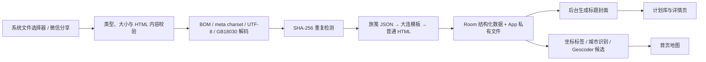

# 旅笺（Lujian）

旅笺是一款原生 Android HTML 旅行计划阅读器。它把微信或手机文件中的旅行计划导入本地，自动提取标题、日期、行程和目的地，并通过纸张风格地图、计划卡片与单轴日期阅读器呈现。

应用以本地使用为主：不需要账号，不上传计划到业务服务器；地图和地理解析需要网络，已经导入的计划内容可离线阅读。

## 项目信息

| 项目 | 当前配置 |
| --- | --- |
| 应用名称 | 旅笺 |
| Application ID | `com.lujian.travelplan` |
| 当前版本 | `1.0.1`（versionCode 2） |
| 最低系统 | Android 8 / API 26 |
| 编译与目标 SDK | API 37 |
| 主要技术 | Kotlin、Jetpack Compose、Room、Navigation Compose |
| 地图 | MapLibre Native 13.3.0 + OpenFreeMap Positron |
| HTML 处理 | Jsoup、隔离 WebView、WebViewAssetLoader |
| 后台任务 | WorkManager |

## 主要功能

### 首页地图

- 米白纸张配色、低饱和水域和道路、粗描边圆角地图窗口。
- 默认完整显示中国范围；任一目的地位于境外时自动切换到全球范围。
- 同一位置附近的目的地自动聚合。
- 使用低饱和红色球头和短墨色直针标记目的地。
- 首次点击大头针，在针上方显示计划名称；再次点击大头针或点击信息框进入计划。
- 地图加载失败不会阻塞本地计划阅读，并提供重试入口。

### 计划库

- 双列方形卡片，添加入口与计划封面保持同尺寸。
- 缩略图优先提取 HTML 的标题区块；提取失败时使用计划标题生成纸张风格封面。
- 标题、地点和日期显示在封面框下方。
- 管理模式支持单选、全选、取消全选和批量删除；添加卡不会因进入管理模式而移位。
- 通过系统文件选择器导入，也可接收微信等应用发送的 `ACTION_SEND` / `ACTION_VIEW` HTML 文件。

### 计划阅读与编辑

- 增强计划使用顶部横向单轴日期栏，一次只显示一天。
- 点击日期或左右滑动均可切换当天内容，当前日期自动居中。
- 展示行程项、时间、类别、费用、备注以及预算、交通、住宿等补充区块。
- 支持编辑计划名、目的地、日期、每日标题和行程项。
- 行程项支持新增、删除、排序以及编辑时间、类别、费用和备注。
- 保存时生成新的移动版 HTML，原始导入文件永不覆盖。
- 支持查看原始 HTML，并通过系统文档创建器导出 UTF-8 HTML。

### 主导航与个人页

- 底部固定“首页 / 计划库 / 我”三个入口。
- 点击底栏或在根页面左右滑动都可切换页面，底栏指示块与页面同步动画。
- “我”页展示计划数、目的地数和旅行天数；当前不包含账号功能。
- 系统关闭动画时，开屏与页面动画会退化为短淡入或直接切换。

## HTML 导入流程



导入约束：

- 接受 `.html`、`.htm`、`text/html`、`application/xhtml+xml`。
- `application/octet-stream` 必须通过 HTML 内容校验。
- 单文件上限为 50 MB。
- 编码识别顺序为 BOM、`meta charset`、严格 UTF-8、GB18030。
- 相同文件按 SHA-256 识别，可选择更新原计划、保留副本或取消。
- 原始字节、生成版 HTML 和缩略图保存在 App 私有目录；结构化内容保存在 Room。

## HTML 兼容级别

| 类型 | 识别方式 | 阅读方式 | 结构化编辑 |
| --- | --- | --- | --- |
| 旅笺增强格式 | `script#lujian-plan`，`schemaVersion=1` | 原生单轴日期阅读器 | 支持 |
| 大连模板 | `.day-col` 等现有模板结构 | 原生单轴日期阅读器 | 支持 |
| 普通 HTML | 其他有效 HTML | 安全 WebView | 不支持，仅查看 |

解析顺序固定为：`LujianJsonParser → DalianTemplateParser → GenericHtmlParser`。

普通 HTML 会优先读取显式地理标签；没有标签时，会从页面标题、标题元素和正文中识别内置城市。如果只有地点名没有坐标，则继续使用 Android `Geocoder` 生成候选位置。无法确认位置的计划仍会进入计划库，但不会显示在首页地图。

## 旅笺增强数据格式

HTML 中必须包含且只能包含一个 JSON 元数据块：

```html
<script id="lujian-plan" type="application/json">
{
  "schemaVersion": 1,
  "title": "大连五日旅行计划",
  "destinations": [
    {
      "name": "大连",
      "countryCode": "CN",
      "latitude": 38.914,
      "longitude": 121.6147
    }
  ],
  "days": [
    {
      "id": "day-1",
      "label": "9月25日",
      "title": "抵达大连",
      "items": [
        {
          "id": "item-1",
          "time": "10:00",
          "title": "星海广场",
          "category": "景点",
          "cost": "免费",
          "notes": "海边风大，带一件外套"
        }
      ]
    }
  ],
  "budget": "预计 3000 元",
  "transport": "地铁与步行",
  "accommodation": "中山区",
  "notes": "提前查看天气"
}
</script>
```

数据契约：

- `schemaVersion` 必须是数字 `1`。
- `title`、`destinations`、`days` 必填且不能为空。
- `destinations` 可使用带坐标的对象，也兼容非空城市名称字符串。
- 每个日期必须提供非空 `id`、`label`、`title` 和 `items` 数组。
- 每个行程项必须提供非空 `id`、`time`、`title`、`category`，并提供字符串 `notes`；`cost` 可选。
- `sections`、`budget`、`transport`、`accommodation`、`notes` 为可选补充内容。
- App 只校验数据契约，不依赖页面 Tab ID、布局结构或具体脚本实现。

## 普通 HTML 地理标签

推荐在 `<head>` 中直接提供坐标，这样导入后无需二次定位：

```html
<meta name="lujian:destination" content="大连">
<meta name="lujian:country-code" content="CN">
<meta name="lujian:latitude" content="38.914">
<meta name="lujian:longitude" content="121.6147">
```

同时兼容 `travel:destination`、`geo.placename`、`geo.position`、`ICBM`，以及元素上的 `data-lujian-destination`、`data-destination`、`data-latitude`、`data-longitude`。

## 缩略图封面约定

缩略图按以下优先级选择 HTML 标题区块：

1. `[data-lujian-cover]`
2. `.hero h1`
3. `main h1`
4. `h1`
5. `.logo-title`

推荐为计划主标题增加显式标记：

```html
<section data-lujian-cover>
  <h1>五天说走就走，把大连吃个痛快。</h1>
</section>
```

封面在后台以 640 × 640 像素生成，导入流程不会等待截图完成。`ThumbnailWorker.INPUT_CUSTOM_COVER_PATH` 已预留自定义封面输入，当前版本尚未开放用户侧封面选择入口。

## 安全边界

- 使用 Android Storage Access Framework 和内容 URI，不申请宽泛存储权限。
- Manifest 禁止明文网络流量。
- 普通 HTML 通过 `WebViewAssetLoader` 从 App 私有目录加载，不使用 `file://`。
- WebView 默认禁用 JavaScript、文件访问、内容访问、跨文件 URL 权限、混合内容和下载。
- 不向 HTML 暴露原生 JavaScript Bridge。
- 顶层 HTTPS 外链交给系统浏览器，HTTP 和其他非法跳转被阻止。
- 兼容模式只为单个计划开启 JavaScript 与 DOM Storage，仍不开放文件访问或原生桥。
- 当前应用允许 Android 系统备份，但没有自建账号、云同步或业务服务器上传逻辑。

## 工程结构

```text
app/src/main/java/com/lujian/travelplan/
├─ data/          Room 实体、DAO、数据库和 PlanRepository
├─ export/        移动版独立 HTML 生成
├─ importing/     文件校验、编码识别、导入、定位和缩略图任务
├─ map/           地图主题、视野策略和目的地聚合
├─ model/         计划、日期、行程项和目的地模型
├─ parser/        增强格式、大连模板和普通 HTML 解析器
├─ ui/            Compose 导航、主题、组件和页面
└─ web/           HTML 安全策略
```

核心职责：

- `PlanImportService`：读取内容 URI、限制大小、编码识别、哈希去重、解析并触发封面任务。
- `CompositePlanParser`：按能力优先级选择解析器。
- `PlanRepository`：持久化计划图、事务编辑、定位确认、批量删除和导出文件选择。
- `PlanReindexService`：启动时为旧计划补充地点并升级缩略图。
- `LujianRoot`：三栏导航、根页面滑动、导入反馈与地点确认。

## 本地构建

### 环境要求

- JDK 17
- Android SDK 37
- Windows 使用仓库中的 `gradlew.bat`；macOS/Linux 使用 `./gradlew`
- Gradle Wrapper 会使用 Gradle 9.5.0，Android Gradle Plugin 为 9.3.0

如果 Android Studio 没有自动生成 `local.properties`，可手动配置：

```properties
sdk.dir=C\:\\Android\\Sdk
```

### Windows PowerShell

```powershell
$env:JAVA_HOME = 'C:\path\to\jdk-17'
.\gradlew.bat testDebugUnitTest lintDebug assembleDebug
```

### macOS / Linux

```bash
export JAVA_HOME=/path/to/jdk-17
./gradlew testDebugUnitTest lintDebug assembleDebug
```

Debug APK 输出到：

```text
app/build/outputs/apk/debug/app-debug.apk
```

连接已授权的 Android 手机后可侧载：

```powershell
adb install -r app\build\outputs\apk\debug\app-debug.apk
```

## 测试

```powershell
# JVM 单元测试
.\gradlew.bat testDebugUnitTest

# Android Lint
.\gradlew.bat lintDebug

# 连接模拟器或真机后执行 UI 测试
.\gradlew.bat connectedDebugAndroidTest
```

当前测试覆盖编码识别、文件类型与大小、SHA-256、增强格式契约、解析器优先级、导出再导入、地图视野、地点聚合、标题封面、批量选择、WebView 安全策略和单轴日期滑动。

## 从微信导入

1. 在微信文件传输助手中打开 `.html` 或 `.htm` 文件。
2. 选择“用其他应用打开”或“分享”。
3. 选择“旅笺”。
4. 如检测到重复计划，选择更新、保留副本或取消。
5. 如地点需要确认，核对候选坐标；确认后大头针会出现在首页。

也可以在“计划库”点击虚线“添加计划”卡，从系统文件选择器中选择 HTML。

## 当前限制

- 首版只保证单文件或自包含 HTML；外置资源目录、ZIP 行程包和批量导入不在当前范围。
- 普通 HTML 只保证安全查看，不保证转换为日期轴或支持结构化编辑。
- 地图底图和未知地点的 Geocoder 解析依赖网络；计划正文、Room 数据和私有文件可离线使用。
- 暂不包含账号、云同步、全离线地图、深色主题和应用商店发布配置。
- 仓库当前产物为 debug 签名 APK；正式发布前需要配置独立签名和发布构建。
- 当前仓库未附带 `LICENSE` 文件，分发前应补充明确的许可协议。
