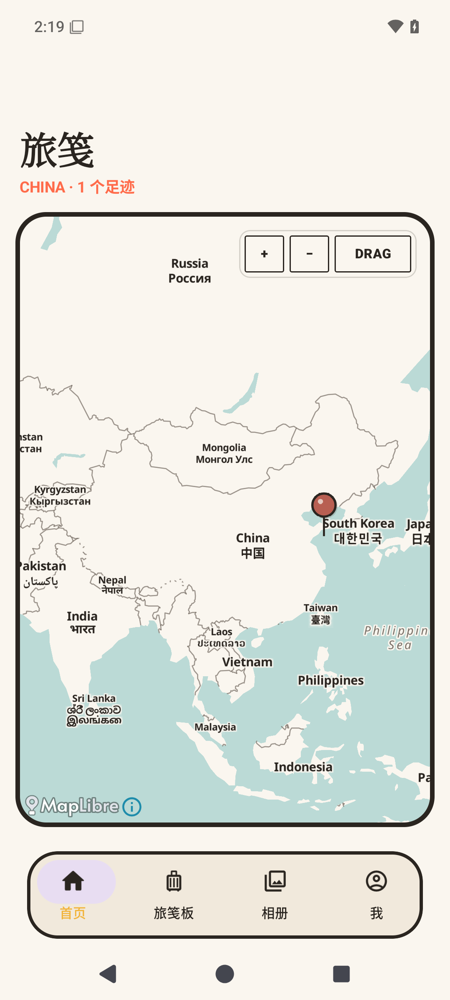
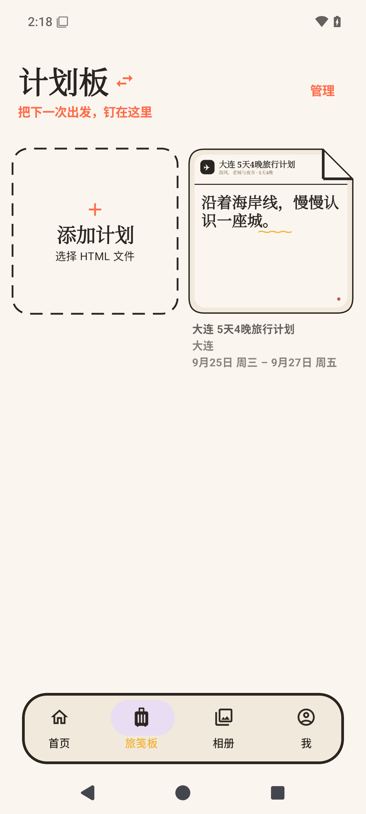
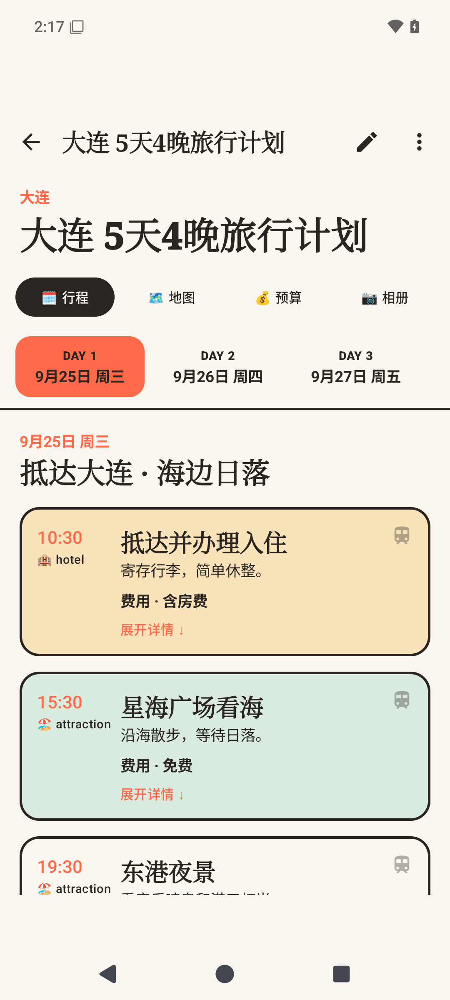
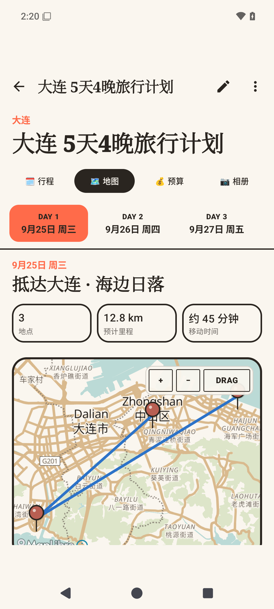
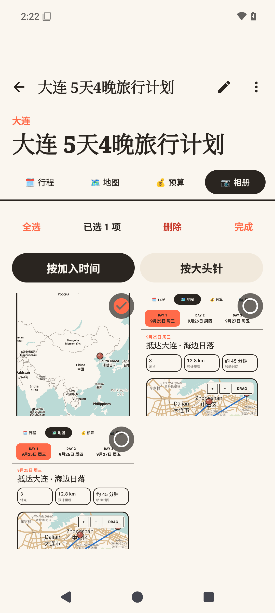
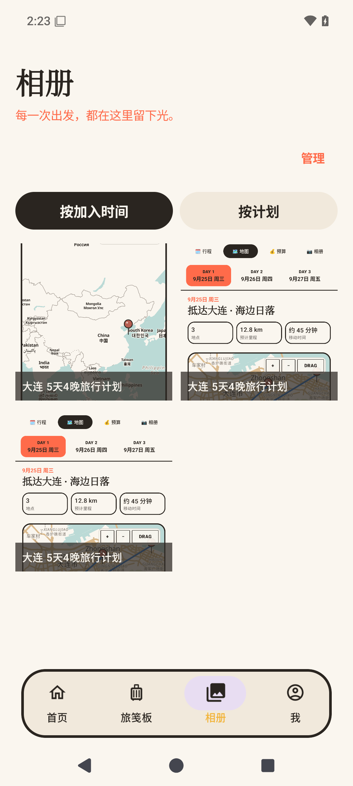
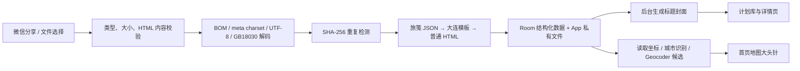

# 🧳 旅笺 · Lujian

<div align="center">

### 把一份 HTML 行程，变成手机里随手翻阅的旅行手账

**导入文件 · 自动认地点 · 路线地图 · 按天阅读 · 私有相册 · 归档足迹**

</div>

> 旅行计划不该在聊天记录里失踪，也不该在出发当天变成一场“文件到底存哪了”的寻宝游戏。<br>
> **旅笺**把微信或手机中的 HTML 行程收进原生 Android / iOS App：地图负责看世界，卡片负责收藏出发，日期轴负责陪你过好每一天。

旅笺以本地使用为主：无需注册账号，不把旅行计划上传到业务服务器。地图底图与未知地点解析需要网络，已经导入的计划可离线阅读。

## 📸 现在长这样

<table>
  <tr>
    <td align="center" width="33%">
      <br>
      <b>📍 目的地都在地图上</b><br>
      <sub>大头针聚合计划，地图支持缩放与拖动锁定</sub>
    </td>
    <td align="center" width="33%">
      <br>
      <b>🗃️ 待出发与走过的旅程</b><br>
      <sub>计划板归档到足迹板，也能随时恢复</sub>
    </td>
    <td align="center" width="33%">
      <br>
      <b>🗓️ 一天一天读</b><br>
      <sub>日期点选与左右滑动同步，行程卡可展开</sub>
    </td>
  </tr>
  <tr>
    <td align="center" width="33%">
      <br>
      <b>🗺️ 当天路线直接展开</b><br>
      <sub>地点、顺序、预计里程和移动时间一起看</sub>
    </td>
    <td align="center" width="33%">
      <br>
      <b>📷 每个地点都有相册</b><br>
      <sub>按时间或大头针浏览，支持跨分类批量管理</sub>
    </td>
    <td align="center" width="33%">
      <br>
      <b>🌄 所有出发汇成一本相册</b><br>
      <sub>按加入时间混排，或按旅行计划回看</sub>
    </td>
  </tr>
</table>

> 截图由 Android 37 模拟器（1080 × 2400）运行 `1.2.0` 生成，使用仓库数据契约构造的演示行程；地图底图需要联网加载。

## 🆕 1.2.0 新增

- **旅笺板**：原计划库升级为计划板/足迹板，支持多选、全选、批量归档、恢复和删除。
- **每日路线地图**：把当天地点按顺序落针连线，展示预计里程与移动时间；地图可缩放、锁定/解锁拖动，并从地点卡跳转高德或百度地图。
- **手动定位兜底**：地点解析不到时，可直接在地图上点选坐标，不阻塞 HTML 导入和离线阅读。
- **计划相册**：从行程卡或地图地点卡添加照片，按加入时间或大头针浏览。
- **全局相册**：跨计划汇总照片，可按加入时间混排或按计划分组。
- **批量相册管理**：计划相册和全局相册都支持跨分类多选、全选和批量删除；删除自定义预览图后自动恢复默认封面。
- **自定义预览图**：编辑计划时可选择、更换或恢复默认预览图，照片始终复制到 App 私有目录。

## ✨ 核心能力

| 能力 | 旅笺怎么做 | 你得到什么 |
| --- | --- | --- |
| 📥 HTML 导入 | 系统文件选择器、微信“用其他应用打开/分享” | 不用复制粘贴，原文件直接收进旅笺板 |
| 🧭 地点识别 | 读取旅笺坐标标签、常见地理标签、城市文本与 Geocoder 候选，失败时支持地图点选 | 导入后自动落针；机器找不到也能由你手动校正 |
| 🗺️ 纸张地图 | MapLibre + 低饱和纸张主题 | 中国计划看中国，出现境外目的地自动看全球 |
| 📌 计划大头针 | 复古红色球头、短墨色直针、针上方信息框 | 第一次点开名称，第二次进入计划 |
| 🛣️ 每日路线 | 当天地点顺序落针连线、里程/耗时摘要、地点卡与外部地图入口 | 先看清怎么走，再决定在哪停留 |
| 🗃️ 旅笺板 | 流畅切换计划板/足迹板，支持批量归档、恢复与删除 | 待出发和走过的旅程各归其位 |
| 🗓️ 原生计划阅读 | 行程、每日地图、预算、相册四页签，日期点选与左右滑动同步 | 卡片可展开、跳转地图，并按地点收藏照片 |
| ✍️ 结构化编辑 | 编辑计划内容并自选预览图 | 临时改时间、费用、备注或封面，不必重做整份 HTML |
| 📷 双层相册 | 计划内按加入时间/大头针浏览，全局按加入时间/计划汇总，两个相册均支持批量管理 | 每张照片都归属具体计划和地点，可批量删除私有副本而不影响系统原图 |
| 🌐 原页查看 | 普通 HTML 进入隔离 WebView，增强计划可核对原页 | 原设计保留，移动阅读也不打折 |
| 📤 独立导出 | 生成 UTF-8、无 BOM、自包含移动版 HTML | 编辑结果可以再次保存、分享和重新导入 |
| 🔒 本地优先 | Room + App 私有文件，默认无账号和业务云端 | 行程属于你，断网也能继续看正文 |

## 🚀 30 秒上手

### 方法一：从微信导入

1. 在微信文件传输助手中打开 `.html` 或 `.htm` 旅行计划。
2. 选择“用其他应用打开”或“分享”。
3. 选择 **旅笺**。
4. 如果地点只有名称没有坐标，核对 App 给出的定位候选。
5. 导入完成：计划进入旅笺板，确认过的位置会同步出现在首页地图。

### 方法二：从旅笺板导入

1. 打开底部 **旅笺板**。
2. 点击与计划卡同尺寸的虚线 **添加计划** 卡片。
3. 从系统文件选择器中选取 HTML 文件。
4. 遇到重复文件时，选择更新原计划、保留副本或取消。

### 阅读、编辑与导出

1. 在首页点大头针，或在旅笺板点计划卡进入详情；便签会从原位置平滑展开，返回时反向收回。
2. 在“🗓️ 行程 / 🗺️ 地图 / 💰 预算 / 📷 相册”之间切换；日期栏会在行程与地图之间保持同步。
3. 展开行程卡，或使用地图下方的地点卡，可查看下一段交通、跳转高德/百度地图，为对应大头针添加照片并进入地点相册。
4. 计划内相册可按加入时间或大头针浏览；底部全局相册可按加入时间或计划浏览。
5. 在任一相册点击 **管理**，可跨分类多选或全选地点照片与自定义预览图；删除只影响旅笺私有副本。
6. 点击右上角铅笔进入编辑模式；除行程内容外，还可选择、更换或恢复默认预览图。
7. 从更多菜单查看原始 HTML，或导出新的独立 HTML 文件。

### 管理多个计划

1. 点击旅笺板左上标题，在 **计划板 / 足迹板** 之间切换。
2. 点击右上角 **管理**，可多选或全选计划。
3. 计划板可批量归档到足迹板，足迹板可批量恢复；删除前会再次确认。

## 🧠 导入一份 HTML 后发生了什么



导入约束：

- 支持 `.html`、`.htm`、`text/html`、`application/xhtml+xml`。
- `application/octet-stream` 必须通过真实 HTML 内容校验。
- 单文件上限 50 MB。
- 编码识别顺序：BOM → `meta charset` → 严格 UTF-8 → GB18030。
- 使用 SHA-256 识别重复内容。
- 原始字节永不被编辑流程覆盖；移动版 HTML 与缩略图另行保存。
- 缩略图异步生成，导入成功不会等待截图完成。
- 缩略图优先截取 `data-lujian-cover` 标记的品牌栏与主标题；旧模板回退到主标题，最后才生成文字封面。

## 🧩 三种 HTML，三种接入深度

| 类型 | 如何识别 | 阅读体验 | 地图 | 结构化编辑 |
| --- | --- | --- | --- | --- |
| 旅笺增强格式 | `script#lujian-plan`，`schemaVersion=1` | 原生行程 / 每日地图 / 预算 | 读取每日地点与路线坐标 | ✅ 支持 |
| 大连模板 | `.day-col` 等现有模板结构 | 原生日期轴阅读器 | 内置模板地点 | ✅ 支持 |
| 普通 HTML | 其他有效 HTML | 安全 WebView | 尝试标签、城市识别和定位确认 | 👀 仅查看 |

解析顺序固定为：

```text
LujianJsonParser → DalianTemplateParser → GenericHtmlParser
```

普通 HTML 不会因为无法定位而导入失败：它仍会出现在计划库，只是在地点确认前不会显示地图大头针。

## 📝 旅笺增强格式

如果你负责生成旅行计划 HTML，建议在页面中加入一段机器可读元数据。页面负责好看，JSON 负责让 App 准确理解它。

```html
<script id="lujian-plan" type="application/json">
{
  "schemaVersion": 1,
  "title": "大连五日旅行计划",
  "destinations": [
    {
      "name": "大连",
      "countryCode": "CN",
      "latitude": 38.914,
      "longitude": 121.6147
    }
  ],
  "days": [
    {
      "id": "day-1",
      "label": "9月25日",
      "title": "抵达大连",
      "items": [
        {
          "id": "item-1",
          "time": "10:00",
          "title": "星海广场",
          "category": "景点",
          "cost": "免费",
          "notes": "海边风大，带一件外套"
        }
      ]
    }
  ],
  "budget": "预计 3000 元",
  "transport": "地铁与步行",
  "accommodation": "中山区",
  "notes": "提前查看天气"
}
</script>
```

### 数据契约

- HTML 中必须且只能包含一个 `lujian-plan` 元数据块，类型为 `application/json`。
- `schemaVersion` 必须是数字 `1`。
- `title`、`destinations`、`days` 必填且不能为空。
- `destinations` 可使用带坐标对象，也兼容非空城市名称字符串。
- 每个日期提供非空 `id`、`label`、`title` 和 `items` 数组。
- 每个行程项提供非空 `id`、`time`、`title`、`category` 与字符串 `notes`；`cost` 可选。
- `sections`、`budget`、`transport`、`accommodation`、`notes` 是可选补充内容。
- App 只依赖数据契约，不要求生成页面使用指定 Tab ID、布局或脚本实现。

## 📍 给普通 HTML 加一个“地理书签”

最稳妥的方式是在 `<head>` 中直接写入目的地和坐标。这样导入后可直接落针，不必等待二次定位。

```html
<meta name="lujian:destination" content="大连">
<meta name="lujian:country-code" content="CN">
<meta name="lujian:latitude" content="38.914">
<meta name="lujian:longitude" content="121.6147">
```

同时兼容：

- `travel:destination`
- `geo.placename`
- `geo.position`
- `ICBM`
- `data-lujian-destination` / `data-destination`
- `data-latitude` / `data-longitude`

## 🖼️ 让计划卡片挑中正确封面

旅笺会尝试从 HTML 标题区域生成 640 × 640 封面，优先级如下：

1. `[data-lujian-cover]`
2. `.hero h1`
3. `main h1`
4. `h1`
5. `.logo-title`

推荐给静态品牌栏与主标题的共同容器加一个明确标记；文字必须直接写入 HTML，不能只靠 JavaScript 填充：

```html
<section data-lujian-cover>
  <div class="brand">✈️ 大连旅行计划</div>
  <h1>五天说走就走，把大连吃个痛快。</h1>
</section>
```

取不到标题区块时，App 会使用文件标题生成纸张风格文字封面。编辑页也可从系统照片选择器自定义预览图。

## 🔐 普通 HTML 的安全边界

- 通过 Android Storage Access Framework 和内容 URI 导入，不申请宽泛存储权限。
- 自选预览图与地点照片会复制到 App 私有目录，不写入 MediaStore，因此系统相册不会出现重复图片；原图不会被移动或删除。
- Manifest 禁止明文网络流量。
- 使用 `WebViewAssetLoader` 加载 App 私有内容，不使用 `file://`。
- 默认禁用 JavaScript、文件访问、内容访问、混合内容和下载。
- 不向 HTML 暴露原生 JavaScript Bridge。
- 顶层 HTTPS 外链交给系统浏览器，HTTP 与非法跳转会被阻止。
- 兼容模式只针对单个计划开启 JavaScript 与 DOM Storage，仍不开放本地文件和原生桥。

## 📦 版本与安装

### Android 1.2.0

| 项目 | 当前配置 |
| --- | --- |
| 应用名称 | 旅笺 |
| Application ID | `com.lujian.travelplan` |
| 当前版本 | `1.2.0`（versionCode 4） |
| 最低系统 | Android 8 / API 26 |
| 编译与目标 SDK | API 37 |
| CPU 架构 | 由 debug 构建依赖自动打包 |
| 安装形式 | debug 签名侧载 APK（Releases 提供） |

#### Android 手机直接安装

1. 在手机上打开 [Android v1.2.0 Release](https://github.com/M1gr4ine/lujian-travel-plan-app/releases/tag/v1.2.0)。
2. 展开 **Assets**，下载 `app-debug.apk`。
3. 点击下载完成的 APK；如果系统拦截，按提示允许当前浏览器或文件管理器“安装未知应用”。
4. 确认安装。系统提示应用有风险时，核对下载地址确实属于本仓库后再继续。

升级安装要求新旧 APK 使用相同签名。如果出现“签名不一致”或“与现有应用冲突”，先导出需要保留的旅行计划，再卸载旧版；卸载会删除 App 私有目录中的计划和照片。

#### Android ADB 安装

本地构建后的 APK 位于：

```text
app/build/outputs/apk/debug/app-debug.apk
```

连接已授权的 Android 手机后安装：

```powershell
adb install -r app\build\outputs\apk\debug\app-debug.apk
```

`-r` 表示保留数据升级安装；签名不一致时不能覆盖。其他已验证版本见 [GitHub Releases](https://github.com/M1gr4ine/lujian-travel-plan-app/releases)。

### iOS 1.0.0

iOS 版使用 SwiftUI、MapKit、PhotosPicker 和隔离 WKWebView，最低支持 iOS 17。安装包位于 [iOS 1.0.0 CI 预发布](https://github.com/M1gr4ine/lujian-travel-plan-app/releases/tag/ios-v1.0.0-ci.4)：

- `Lujian-iOS-Unsigned-1.0.0.ipa`：iPhone 真机包，发布时未包含任何 Apple 证书或 Provisioning Profile。
- `Lujian-iOS-Simulator-1.0.0.app.zip`：只能安装到 Xcode 的 iPhone 模拟器，不能安装到真机。
- `SHA256SUMS.txt`：两个产物的 SHA-256 校验值。

#### iPhone 真机侧载（Windows）

推荐使用 [AltStore Classic](https://faq.altstore.io/altstore-classic/how-to-install-altstore-windows) 自动完成签名，无需手工创建 `.p12`：

1. 安装 Apple 官网版 iTunes、iCloud，以及 AltServer；避免使用来源不明的签名网站或共享证书。
2. 用数据线连接并解锁 iPhone，在手机上选择“信任此电脑”。
3. 以管理员身份启动 AltServer。
4. 按住 `Shift` 点击任务栏中的 AltServer 图标，选择 **Sideload .ipa…**。
5. 选择 `Lujian-iOS-Unsigned-1.0.0.ipa` 和目标 iPhone，使用自己的 Apple ID 完成签名。
6. 在 iPhone 中进入“设置 → 通用 → VPN 与设备管理”，信任该 Apple ID 对应的开发者 App。
7. 进入“设置 → 隐私与安全性 → 开发者模式”，开启后按提示重启并再次确认。

免费 Apple ID 的个人团队签名有效期为 7 天，且每台设备最多同时保留 3 个侧载 App；到期前让手机与运行 AltServer 的电脑处于同一网络，并在 AltStore 中刷新。Development、Ad Hoc 和 TestFlight 也都有有效期，正常渠道中只有通过 App Store 分发才不需要设备端定期重签。

#### iPhone 真机安装（macOS + Xcode）

使用源码和自己的 Apple 开发者身份签名是 Apple 官方开发安装方式：

1. 安装 Xcode 16 或更高版本与 [XcodeGen](https://github.com/yonaskolb/XcodeGen)。
2. 在仓库的 `ios` 目录执行 `xcodegen generate`，然后打开 `Lujian.xcodeproj`。
3. 在 **Lujian Target → Signing & Capabilities** 中勾选 **Automatically manage signing**，选择自己的 Team；如果 Bundle Identifier 被占用，改为自己账号下的唯一标识。
4. 数据线连接 iPhone，信任电脑并开启开发者模式。
5. 在 Xcode 顶部选择该 iPhone，点击 **Run**，Xcode 会自动注册设备、生成描述文件、签名并安装。

#### iPhone 模拟器安装（macOS）

需要 Xcode 16 或更高版本，并先启动一个 iOS 17+ iPhone 模拟器：

```bash
unzip Lujian-iOS-Simulator-1.0.0.app.zip
xcrun simctl install booted Lujian.app
xcrun simctl launch booted com.lujian.travelplan.ios
```

发布流水线已执行全部 Swift 单元测试、两条 iPhone 模拟器 UI 流程，并实际安装、启动模拟器 App；由于没有可用 iPhone，本仓库未声明真机验证通过。详细边界见 [iOS 1.0.0 发布说明](docs/releases/ios-v1.0.0.md)。

## 🛠️ 技术栈

| 领域 | 方案 |
| --- | --- |
| 语言与 UI | Android：Kotlin + Jetpack Compose；iOS：Swift 6 + SwiftUI |
| 页面导航 | Android：Navigation Compose；iOS：SwiftUI NavigationStack |
| 本地数据 | Android：Room；iOS：Codable 原子快照 |
| 后台任务 | WorkManager |
| 地图 | Android：MapLibre Native；iOS：MapKit |
| HTML 解析 | Android：Jsoup + `org.json`；iOS：Foundation + Codable |
| HTML 阅读 | Android：WebViewAssetLoader；iOS：隔离 WKWebView |
| 最低版本 | Android 8 / API 26；iOS 17 |
| 目标版本 | Android API 37；iOS 17+ |

## 🗂️ 工程结构

```text
app/src/main/java/com/lujian/travelplan/
├─ data/          Room 实体、DAO、数据库与 PlanRepository
├─ export/        移动版独立 HTML 生成
├─ importing/     文件校验、编码识别、导入、定位与缩略图任务
├─ map/           地图主题、视野策略与目的地聚合
├─ model/         计划、日期、行程项与目的地模型
├─ parser/        增强格式、大连模板与普通 HTML 解析器
├─ ui/            Compose 导航、主题、组件与页面
└─ web/           HTML 安全策略
```

核心职责：

- `PlanImportService`：读取内容 URI、限制大小、编码识别、哈希去重、解析并触发封面任务。
- `CompositePlanParser`：按增强格式、大连模板、普通 HTML 的优先级选择解析器。
- `PlanRepository`：持久化计划图、事务编辑、定位确认、批量删除与导出文件选择。
- `PlanReindexService`：启动时为旧计划补充地点并升级缩略图。
- `LujianRoot`：首页/旅笺板/相册/我的四栏导航、根页面滑动、导入反馈与地点确认。

## 🧑‍💻 本地开发

### 环境要求

- JDK 17
- Android SDK 37
- Gradle Wrapper 9.5.0
- Android Gradle Plugin 9.3.0

如果 Android Studio 没有自动生成 `local.properties`：

```properties
sdk.dir=C\:\\Android\\Sdk
```

### Windows PowerShell

```powershell
$env:JAVA_HOME = 'C:\path\to\jdk-17'
.\gradlew.bat testDebugUnitTest lintDebug assembleDebug
```

### macOS / Linux

```bash
export JAVA_HOME=/path/to/jdk-17
./gradlew testDebugUnitTest lintDebug assembleDebug
```

### 常用验证

```powershell
# JVM 单元测试
.\gradlew.bat testDebugUnitTest

# Android Lint
.\gradlew.bat lintDebug

# 生成可侧载 APK
.\gradlew.bat assembleDebug

# 连接模拟器或真机后执行 UI 测试
.\gradlew.bat connectedDebugAndroidTest
```

测试覆盖编码识别、伪 HTML 与大小限制、SHA-256 去重、增强格式契约、解析器优先级、导出再导入、地图视野、地点聚合、每日路线、标题封面、计划归档、相册分组与批量删除、WebView 安全策略和单轴日期滑动。

## 🧱 当前边界

- 首版只保证单文件或自包含 HTML；暂不支持外置资源目录、ZIP 行程包和批量导入。
- 普通 HTML 只保证安全查看，不保证转换为日期轴或支持结构化编辑。
- 地图底图和未知地点的 Geocoder 解析依赖网络；已导入的计划正文可离线阅读。
- 暂不包含账号、云同步、全离线地图、深色主题和应用商店发布配置。
- 当前产物使用 debug 签名；正式分发前需要配置独立发布签名。
- 仓库暂未附带 `LICENSE` 文件，公开分发前需补充明确许可协议。

---

<div align="center">

**旅笺不替你决定去哪。它只负责让已经决定好的旅程，随时都找得到。** ✈️

</div>
